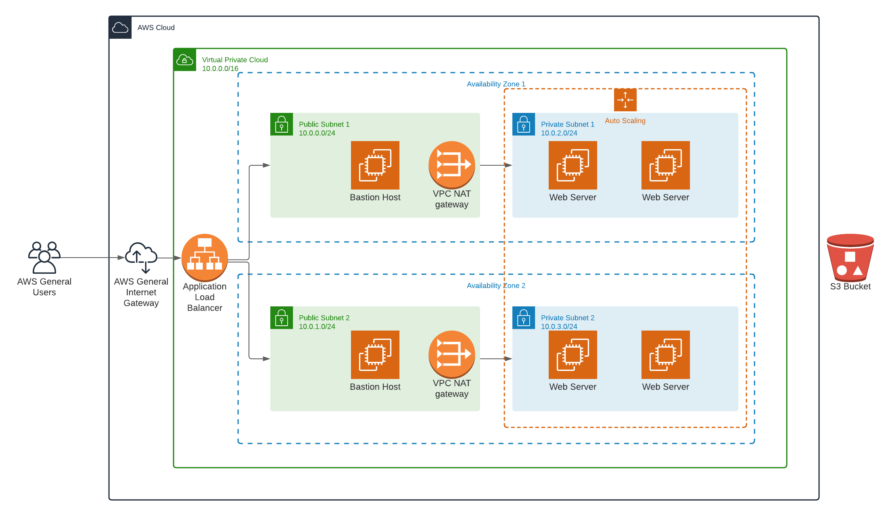

# Udacity CloudFormation Project

## Diagram


## Usage
### Create Infrastructure
```
./create.sh udacity-project-networking networking.yml networking-params.json
./create.sh udacity-project-servers servers.yml server-params.json
```

### Delete Infrastructure
```
./delete.sh udacity-project-servers
./delete.sh udacity-project-networking
```

### Accessing Bastion Hosts
The bastion hosts __do not__ host any private ssh keys to help ensure that 
private keys are not compromised. You must use ssh-agent to add the key on
your local machine, and then use agent forwarding to be able to jump from
the bastion host to the web servers in the private subnets:
```
ssh-agent -s
ssh-add -k ~/.ssh/udacity.pem
ssh ubuntu@$BASTION_IP -Ai ~/.ssh/udacity.pem
```

